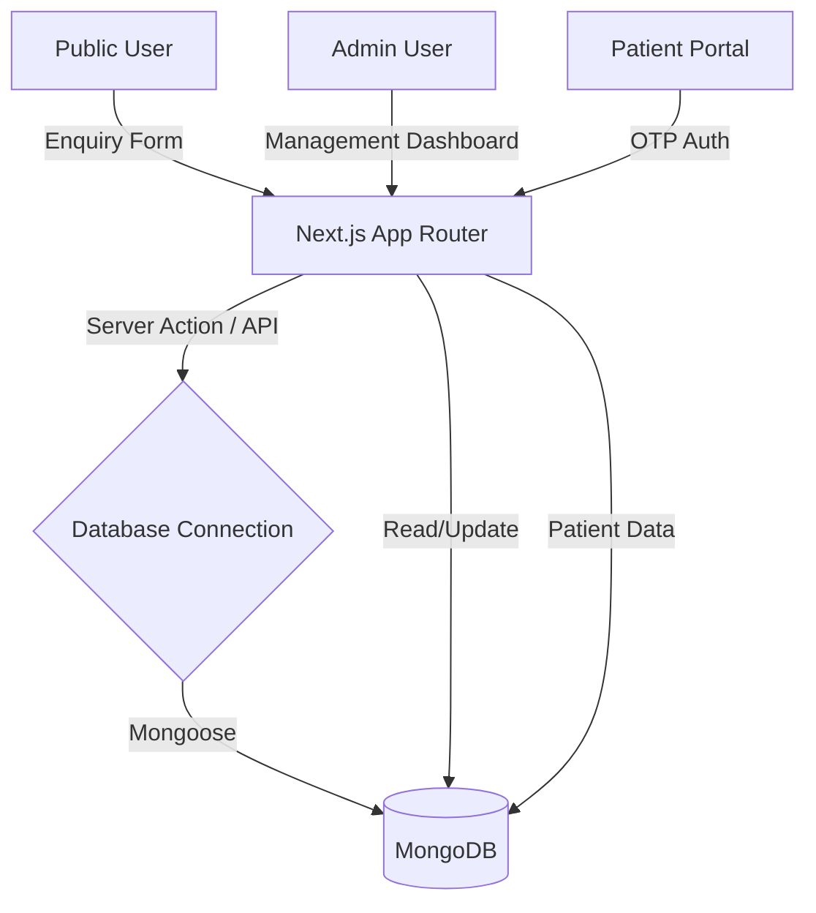

# VSRMS System Architecture

This document describes the high-level architecture and data flow for the VSRMS (Visitor/Staff Remote Management System) platform.

## System Overview
VSRMS is a monolithic Next.js application that handles both the public-facing website and the administrative portals. It uses an inbuilt backend architecture to reduce infrastructure complexity.

## Data Flow Diagram

## Key Components

### 1. Frontend Layer
- **Public Layout**: Optimized for SEO and performance. Uses Framer Motion for premium interactions.
- **Admin Layout**: Dashboard-centric layout with a persistent sidebar and role-based navigation.
- **Shared Components**: High-level UI primitives (Buttons, Inputs, Cards) styled with CSS Variables.

### 2. Backend Layer (Inbuilt)
- **API Routes**: Located in `src/app/api`, providing a RESTful interface for external or client-side fetch calls.
- **Server Actions**: Used for direct form submissions and secure server-side logic (e.g., Auth, DB mutations).
- **Mongoose ODM**: Handles schema validation and database interactions.

### 3. Database Schema
- **User**: Multi-role schema for authentication.
- **Enquiry**: Captures lead information with status tracking (`pending`, `contacted`, `converted`).
- **Booking (Planned)**: Will handle the complexity of vehicle assignment and care scheduling.

## Phase 1A Implementation Progress
| Feature | Status | Description |
| :--- | :--- | :--- |
| Project Scaffold | ✅ | Next.js 15, TS, pnpm, Biome |
| Design System | ✅ | CSS Variable tokens, Glassmorphism utilities |
| Database | ✅ | MongoDB Connection + Base Models |
| Public Home | ✅ | Premium hero, service cards, CTA |
| Enquiry Module | ✅ | Frontend form + POST API + Admin List |
| Documentation | ✅ | README, CLAUDE, Architecture |

---
*Created: April 2026 | Project Ref: ECO-2026-001*
